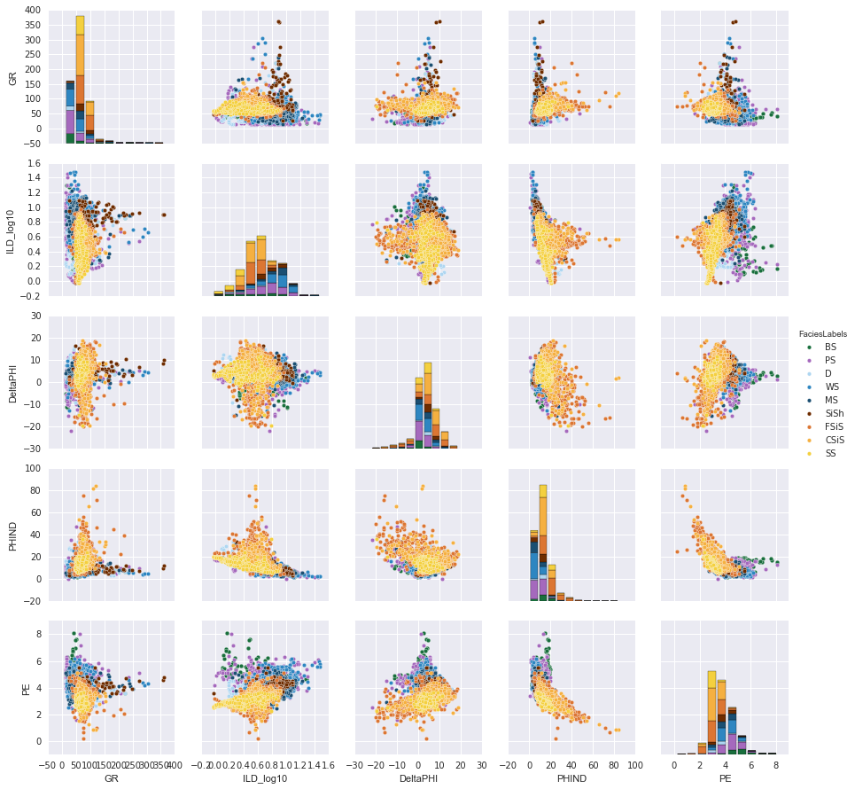
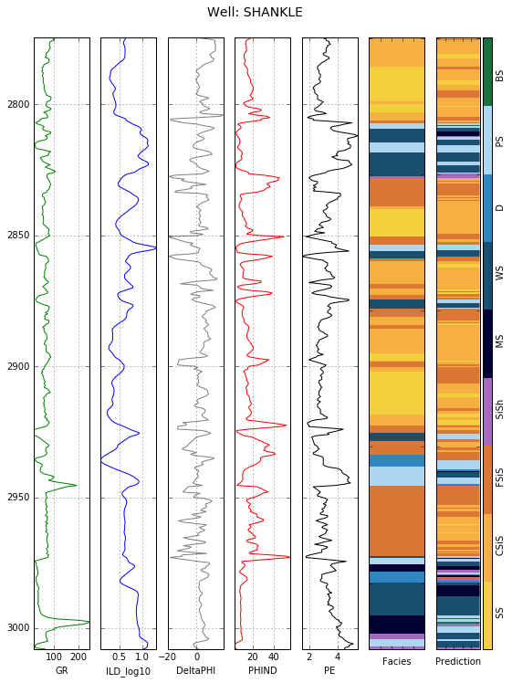

# Tutorial: Facies Classification using Machine Learning

Brendon Hall, [Enthought](https://www.enthought.com/)

There has been much excitement recently about *big data* and the dire need for *data scientists* who possess the ability to extract meaning from it. Geoscientists, meanwhile, have been doing science with voluminous data for years, without needing to brag about how big it is. But now that large, complex datasets are widely available, there has been a proliferation of tools and techniques for analyzing them. Many free and open source packages now exist that provide powerful additions to the geoscientist's toolbox, much of which used to be only available in proprietary (and expensive) software platforms.

One of the best examples is `scikit-learn` (http://scikit-learn.org/), a collection of tools for *machine learning* in Python. What's machine learning? You can think of it as a set of data analysis methods that includes classification, clustering, and regression. These algorithms can be used to discover features and trends within the data without being explicitly programmed, in essence *learning* from the data itself.

In this tutorial, we will demonstrate how to use a classification algorithm known as a support vector machine to identify lithofacies based on well log measurements. Support vector machines (or SVMs) are a type of supervised learning algorithm, which need to be supplied with training data to learn the relationships between the measurements (or features) and the classes to be assigned. In our case, the features will be well log data from nine gas wells. These wells have already had lithofacies classes assigned based on core descriptions. Once we have trained a classifier we will use it to assign facies to wells that have not been described.

## Exploring the dataset

The dataset we will use comes from a University of Kansas class exercise on the Hugoton and Panoma gas fields. For more on the origin of the data, see Dubois et al. (2007) and the Jupyter notebook that accompanies this tutorial at http://github.com/seg.

The dataset consists of seven features (five wireline log measurements and two indicator variables) and a facies label at half foot depth intervals. In machine learning terminology, the set of measurements at each depth interval comprises a *feature vector*, each of which is associated with a *class* (the facies type). We will use the `pandas` library to load the data into a dataframe, which provides a convenient data structure to work with well log data.

```python
>>> import pandas as pd
>>> data = pd.read_csv('training_data.csv')
```

We can use `data.describe()` to provide a quick overview of the statistical distribution of the training data:

|     |Facies|Depth  |GR    |ILD_log10|DeltaPHI|PHIND|PE  |NM_M|RELPOS|
|:---:|:----:|:-----:|:----:|:-------:|:------:|:---:|:--:|:--:|:----:|   
|count|3232  |3232   |3232  |3232     |3232    |3232 |3232|3232|3232  |
|mean |4.42  |2875.82|66.14 |0.64     |3.55    |13.48|3.73|1.50|0.52  |
|std  |2.50  |131.00 |30.85 |0.24     |5.23    |7.70 |0.89|0.50|0.29  | 
|min  |1     |2573.50|13.25 |-0.03    |-21.83  |0.55 |0.20|1   |0.01  |
|25%  |2     |2791.00|46.92 |0.49     |1.16    |8.35 |3.10|1   |0.27  |
|50%  |4     |2932.50|65.72 |0.62     |3.5     |12.15|3.55|2   |0.53  |
|75%  |6     |2980.00|79.63 |0.81     |6.43    |16.45|4.30|2   |0.77  | 
|max  |9     |3122.50|361.15|1.48     |18.60   |84.40|8.09|2   |1.00  |     

**Table 1:** Statistical distribution of the training data set.

We can see from the `count` row that we have a total of 3232 feature vectors in the dataset. The feature vectors consist of the following variables:

1. Gamma ray (GR)
1. Resistivity (ILD_log10)
1. Photoelectric effect (PE)
1. Neutron-density porosity difference (DeltaPHI)
1. Average neutron-density porosity (PHIND)
1. Non-marine/marine indicator (NM_M)
1. Relative position (RELPOS)

There are nine facies classes (numbered 1-9) identified in the dataset. Table 2 contains the descriptions associated with these classes. Note that not all of these facies are completely discrete; some gradually blend in to one another. Mis-classification of these neighboring facies can be expected to occur. The `Adjacent Facies` column in Table 2 lists these related classes.

Facies|Description                |Label|Adjacent Facies
:----:|:-------------------------:|:---:|:-------------:
1     |Non-marine sandstone       |SS   | 2
2     |Non-marine coarse siltstone|CSiS | 1,3
3     |Non-marine fine siltstone  |FSiS | 2
4     |Marine siltstone and shale |SiSh | 5
5     |Mudstone                   |MS   | 4,6
6     |Wackestone                 |WS   | 5,7,8
7     |Dolomite                   |D    | 6,8
8     |Packstone-grainstone       |PS   | 6,7,9
9     |Phylloid-algal bafflestone |BS   | 7,8

**Table 2:** Facies labels with their descriptions.

In order to evaluate the accuracy of the classifier, we will remove one well from the training set so that we can compare the predicted and actual facies labels.

```python
>>> test_well = data[data['Well Name'] == 'SHANKLE']
>>> data = data[data['Well Name'] != 'SHANKLE']
```

Let's extract the feature vectors and the associated facies labels from the training dataset:

```python
>>> features = ['GR', 'ILD_log10', 'DeltaPHI', 'PHIND','PE','NM_M', 'RELPOS']
>>> feature_vectors = data[features]
>>> facies_labels = data['Facies']
```

Crossplots are a familiar tool to visualize how two properties vary with rock type. This dataset contains 5 log measurements, and we can employ the very useful `seaborn` library (Waskom et al. 2016) to create a matrix of cross plots to visualize the variation between the log measurements in the dataset.  

```python
>>> import seaborn as sns
>>> sns.pairplot(feature_vectors[['GR', 'ILD_log10', 'DeltaPHI', 'PHIND','PE']])
```


**Figure 1** Crossplot matrix generated with the `seaborn` library.  

Each pane in Figure 1 shows the relationship between two of the variables on the _x_ and _y_ axis, with a stacked bar plot showing the distribution of each point along the diagonal. Each point is colored according to its facies (see the Jupyter notebook associated with this tutorial for more details on how to generate colors for this plot). It is not clear from these crossplots what relationships exist between the measurements and facies labels. This is where machine learning will prove useful.  

## Conditioning the dataset

Many machine learning algorithms assume the feature data are normally distributed (i.e. Gaussian with zero mean and unit variance). Table 1 shows us that this is not the case with our training data. We will condition, or *standardize* the training data so that it has this property. The same factors used to standardize the training set must be applied to any subsequent dataset that will be classified. `Scikit-learn` includes a handy `StandardScalar` class that can be applied to the training set, and later used to standardize any input data.

```python
>>> from sklearn.preprocessing import StandardScalar
>>> scaler = StandardScaler().fit(feature_vectors)
>>> scaled_features = scaler.transform(feature_vectors)
```

A standard practice when training supervised learning algorithms is to separate some data from the training set in order to evaluate the accuracy of the classifier.  We have already removed data from a single well for this purpose.  It is also useful to have a *cross validation* data set we can use to tune the parameters of the model.  `Scikit-learn` includes a handy function to randomly split the training data into subsets.  Let's use 5% of the data for the cross validation set.

```python
>>> from sklearn.cross_validation import train_test_split
>>> X_train, X_cv, y_train, y_cv = train_test_split(
        scaled_features, facies_labels, 
        test_size=0.05, random_state=42)
```

## Training the classifier

Now we can use the conditioned dataset to train a support vector machine to classify facies.  The concept of a support vector machine is straightforward.  If the data was linearly separable, it would be easy to draw a boundaries between the input data points that identified distinct classes. Figure 1 suggests that our data is not linearly separable. Using a technique known as the 'kernel trick', the data is projected into a higher dimensional space where it is separable. Boundaries, or margins, can be drawn between the data in this space. These boundaries are generated during the training step. 

The SVM implementation in `scikit-learn` (http://scikit-learn.org/stable/modules/svm.html) takes a number of important parameters. These can be used to control the learning rate and the specifics of the kernel functions. The choice of parameters can affect the accuracy of the classifier, and finding optimal parameter choices is an important step known as *model selection*.  A succession of models are created with different parameter values, and the combination with the lowest cross validation error is used for the classifier.  See the notebook accompanying this article for more details on the model selection procedure used to obtain the parameter choices used here.

```python
>>> from sklearn import svm
>>> clf = svm.SVC(C = 10, gamma = 1)
```

Now we can train the classifier using the training set we created above.

```python
>>> clf.fit(X_train, y_train)
```

That's it!  Now that the model has been trained on our data, we can use it to predict the facies of any well with the same set of features as our training set.  We set aside a well for exactly this purpose.  


## Evaluating the classifier

To evaluate the accuracy of our classifier we will use the well we kept for a blind test, and compare the predicted facies with the actual ones.  We need to extract the facies labels and features of this dataset, and rescale the features using the same parameters used to rescale the training set.

```python
>>> y_test = test_well['Facies']
>>> well_features = test_well.drop(['Facies',
                                    'Formation',
                                    'Well Name',
                                    'Depth'],
                                   axis=1)
>>> X_test = scaler.transform(well_features)
```
Now we can use our trained classifier to predict facies labels for this well, and store the results in the `Prediction` column of the `test_well` dataframe.

```python
>>> y_pred = clf.predict(X_test)
>>> test_well['Prediction'] = y_pred
```
Because we know the true facies labels of the vectors in the test dataset, we can use the results to evaluate the accuracy of the classifier on this well.

```python
>>> from sklearn.metrics import classification_report
>>> target_names = ['SS', 'CSiS', 'FSiS', 'SiSh',
                    'MS', 'WS', 'D','PS', 'BS']
>>> print(classification_report(y_test, y_pred,
          target_names=target_names))
```

          Class|  precision|    recall|  f1-score|   support
          :---:|:---------:|:--------:|:--------:|:--------:    
             SS|       0.30|      0.08|      0.12|        89
           CSiS|       0.36|      0.72|      0.48|        89
           FSiS|       0.62|      0.54|      0.58|       117
           SiSh|       0.25|      0.29|      0.27|         7
             MS|       0.17|      0.11|      0.13|        19
             WS|       0.66|      0.54|      0.59|        71
              D|       0.71|      0.29|      0.42|        17
             PS|       0.41|      0.60|      0.49|        40
             BS|       0.00|      0.00|      0.00|         0
    avg / total|       0.47|      0.46|      0.43|       449

**Table 3** Accuracy metrics for the test data set.

Precision and recall are metrics that tell us how the classifier is performing for individual facies. Precision is the probability that, given a classification result for a sample, the sample actually belongs to that class. Recall is the probability that a sample will be correctly classified for a given class. For example, if the classifier predicts that an interval is fine siltstone (FSiS), there is an 62% probability that the interval is actually that lithology (precision). If an interval is actually fine siltstone, there is a 54% probability that it will be correctly classified (recall). The F1 score combines both accuracy and precision to give a single measure of relevancy of the classifier results.

Our classifier achieved an overall F1 score of 0.43 on the test well, so there is room for improvement.  It is interesting to note that if we count misclassification within adjacent facies as correct, the classifier has an overall F1 score of 0.88.

Let's look at the classifier results in log plot form. Figure 2 is based on the plots described in Alessandro Amato del Monte's excellent tutorial from June 2015 of this series. The five logs used as features are plotted along with the actual and predicted lithofacies class log.



**Figure 2.** Well logs and facies classification results from a single well.

This tutorial has provided a brief overview of a typical machine learning workflow; preparing a dataset, training a classifier and evaluating the model.  Libraries such as `scikit-learn` provide powerful algorithms that can be applied to problems in the geosciences with just a few lines of code.  You can find a more details, along with the data and code used for this tutorial at https://github.com/seg.

##References
Amato del Monte, A., 2015. Seismic Petrophysics: Part 1, *The Leading Edge*, 34 (4). [doi:10.1190/tle34040440.1](http://dx.doi.org/10.1190/tle34040440.1)

Dubois, M. K., G. C. Bohling, and S. Chakrabarti, 2007, Comparison of four approaches to a rock facies classification problem, *Computers & Geosciences*, 33 (5), 599-617 pp. [doi:10.1016/j.cageo.2006.08.011](http://dx.doi.org/10.1016/j.cageo.2006.08.011)

Waskom, M, et al. (2016). Seaborn, v0.7, January 2016. Zenodo. [doi:10.5281/zenodo.45133](http://dx/doi.org/10.5281/zenodo.45133)


